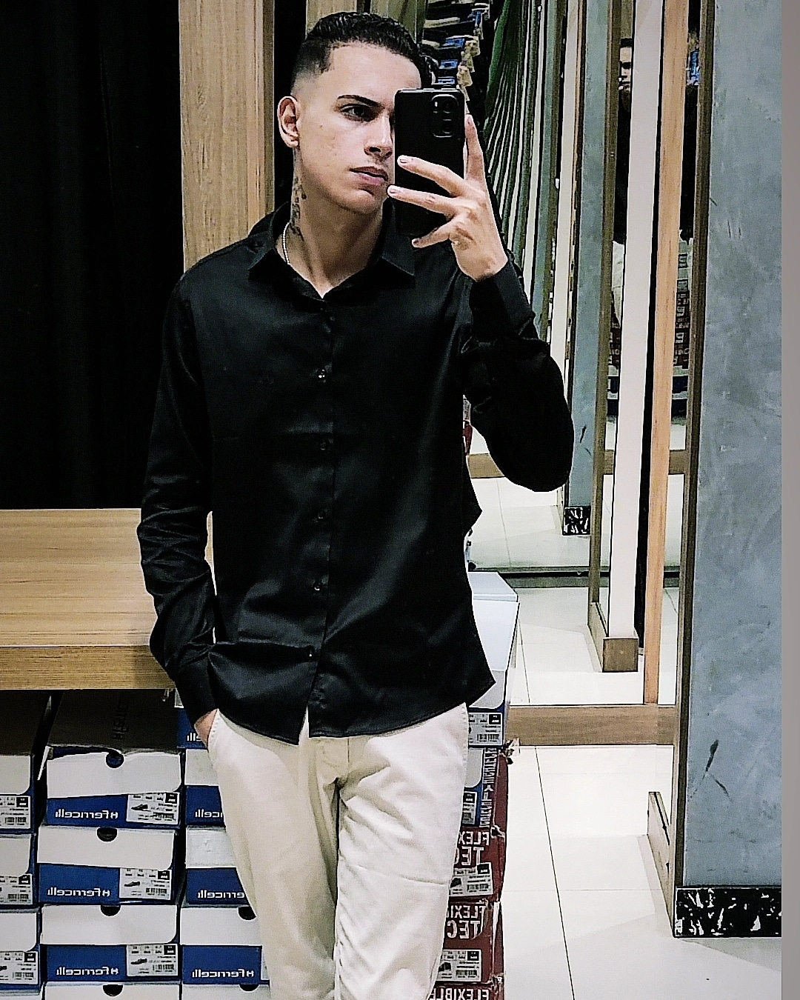

<table>
  <tr>
    <td width="220" align="center">
      
    </td>
    <td>
      <h1>Olá, eu sou o Marrone de Lima Melo! 👋</h1>
      <p>
        <strong>Estudante de Análise e Desenvolvimento de Sistemas</strong><br>
        Java Developer em formação • Backend • Tecnologia
      </p>
      <p>
        ☕ Java &nbsp; • &nbsp; 💻 Backend &nbsp; • &nbsp; 🎓 ADS
      </p>
    </td>
  </tr>
</table>

---

## { Sobre mim }

Meu nome é **Marrone de Lima Melo**, tenho 24 anos e sou apaixonado por tecnologia desde muito novo. Meu contato com computadores começou ainda na infância, principalmente através dos jogos, e com o tempo essa curiosidade se transformou em uma verdadeira paixão por programação.

Atualmente curso **Análise e Desenvolvimento de Sistemas (ADS)** e estou direcionando meus estudos para o desenvolvimento de software, com foco principalmente em **Backend**.

No momento, estou estudando **Java**, lógica de programação e **Programação Orientada a Objetos**, construindo minha base para futuramente me aprofundar em **Spring Boot, APIs REST e bancos de dados**.

Meu objetivo é me tornar um **desenvolvedor Backend**, trabalhar profissionalmente com desenvolvimento de software e continuar evoluindo através de projetos reais, estudos e prática constante.

Gosto de entender como as coisas funcionam por trás do código e transformar ideias em aplicações.

---

## { English Version }

My name is **Marrone de Lima Melo**, I'm 24 years old and I've been passionate about technology since I was very young. My first experiences with computers started during childhood, mainly through games, and over time that curiosity became a genuine passion for programming.

I'm currently studying **Systems Analysis and Development (ADS)** and focusing my studies on software development, with a particular interest in **Backend Development**.

At the moment, I'm studying **Java, programming logic, and Object-Oriented Programming**, building a strong foundation to eventually dive deeper into **Spring Boot, REST APIs, and databases**.

My goal is to become a **Backend Developer**, work professionally with software development, and continue improving through real-world projects, continuous learning, and practice.

I enjoy understanding how things work behind the code and turning ideas into applications.

---

## { Atualmente estudando | Currently studying }

- ☕ **Java**
- 🧠 **Lógica de programação | Programming Logic**
- 🧩 **Programação Orientada a Objetos | Object-Oriented Programming**
- 🌱 **Spring Boot**
- 🗄️ **SQL e bancos de dados | SQL & Databases**
- 🌐 **APIs REST**
- 🔧 **Git & GitHub**
- 💻 **Desenvolvimento Backend | Backend Development**

---

## { Tech Stack }

<p align="left">


&nbsp;&nbsp;

&nbsp;&nbsp;

&nbsp;&nbsp;

&nbsp;&nbsp;


</p>

---

## { Minha jornada | My journey }

```text
Computadores
     ↓
Curiosidade
     ↓
Tecnologia
     ↓
ADS
     ↓
Java
     ↓
Programação
     ↓
Backend
     ↓
Desenvolvimento de Software
